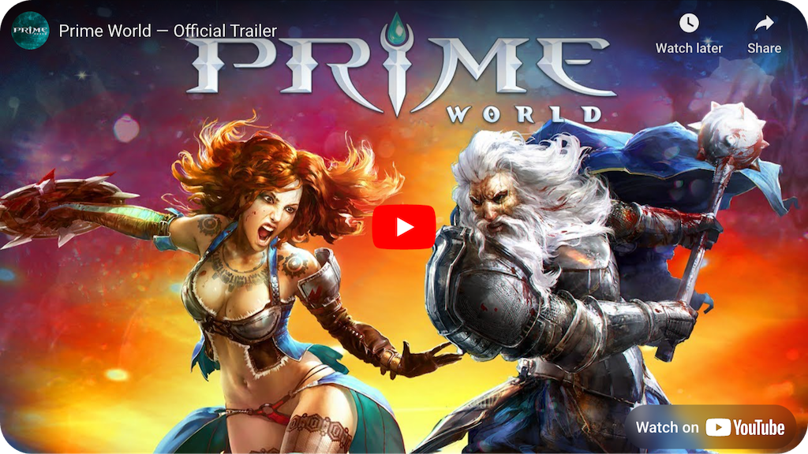

[English](README.md)        [Русский](docs/readme/README.ru.md)        [中文](docs/readme/README.zh.md)        [हिन्दी](docs/readme/README.hi.md)        [Español](docs/readme/README.es.md)        [Français](docs/readme/README.fr.md)        [Deutsch](docs/readme/README.de.md)        [Português](docs/readme/README.pt.md)        [日本語](docs/readme/README.ja.md)        [Bahasa Indonesia](docs/readme/README.id.md)

[](https://youtu.be/Fkd-zva4npI)
[Prime World](https://wikipedia.org/wiki/Prime_World) is a multiplayer online battle arena (MOBA) game released in 2014. The game was developed on an in-house game engine by the company [Nival](http://nival.com/), primarily written in C++.

The game consists of two parts: Castle and Battle part. The player takes on the role of a Lord or Lady. In the Castle, the player constructs buildings, hires Heroes, and chooses Talents for them. In the Battle part, the player controls a Hero and uses Talents to fight against other players in team battles.

In 2024, the source code of the Battle part of the game was released under a [special license](LICENSE.md), prohibiting commercial use but fully open for the gaming community, study, and research purposes.
Please read the terms of the [license agreement](LICENSE.md) carefully before use.

## What's in this repository

The repository is organised by domain. Top-level layout:

| Folder | What's inside |
|--------|---------------|
| `client/` | Client C++ sources (`client/src`), pre-built client (`client/build`), Flash UI (`client/flash-ui`), auto-updater (`client/launcher`) |
| `server/` | Battle server (`server/battle`), social backend (`server/social`), aggregator (`server/socagr`), cluster control-center (`server/control-center`) |
| `engine/` | Shared C++ game engine: `core`, `render`, `scene`, `sound`, `network`, `ui`, `terrain`, `system`, `game`, `types`, `scripts`, plus the top-level `PF.sln`, `SocialTypes_12.sln`, `CMakeLists.txt` and version resources |
| `editor/` | Game data editor — `editor/src` (C#/C++ sources). The pre-built `PF_Editor.exe` ships with the client at `client/build/Bin/PF_Editor.exe`. |
| `tools/` | Developer tools: `mesh-converter`, `shader-compiler`, `maya-*`, plus the original operations tools (Censor, TestFramework, Billing, InnoTest, GMTools, ...) |
| `assets/` | Runtime game data the engine loads: `heroes`, `creeps`, `buildings`, `items`, `maps`, `effects`, `ui`, `audio`, `shaders`, `gfx-textures`, ... |
| `assets-source/` | Pre-compiled source art: `styles`, `icons`, `screens`, `cursors`, `textures-default` — PNG sources that compile to `assets/ui/...` DDS files |
| `localization/` | Per-locale voice-over and text: `en-US`, `ru-RU`, `de-DE`, `fr-FR`, `tr-TR`, `lt-LT`, `pl-PL`, `vi-VN`, `ru-MO` |
| `profiles/` | Game configuration: `game.cfg`, `private.cfg_example`, type hashes |
| `vendor/` | Third-party libraries: boost, fmod, DirectX, Steam, Maya, wxWidgets, CEF, OpenSSL, MySQL, Thrift, etc. |
| `archive/` | Legacy or deprecated content kept for reference: `server-old`, `pf-server-cmds-old`, `deprecated-shaders`, historical crash dumps |
| `docs/` | Documentation: [REPO_STRUCTURE.md](docs/REPO_STRUCTURE.md), translated READMEs, licence PDFs, art tech specs |

The game data editor lives at `client/build/Bin/PF_Editor.exe` (shipped alongside the client).
The pre-built battle client lives at `client/build/Bin/PW_Game.exe`.
The pre-built battle server lives at `server/battle/build/`.

## Quick start

```powershell
git clone https://github.com/meonisk/Prime-World.git
cd Prime-World
pip install gdown tqdm
python tools\assets\fetch_assets.py --all
powershell -ExecutionPolicy Bypass -File tools\setup\setup.ps1
# edit profiles\game.cfg: local_game 0 -> local_game 1
client\build\Bin\PW_Game.exe
```

`setup.ps1` creates all the Data/Localization/Profiles junctions next to the `Bin/` folder and the old-name aliases inside `assets/` that the prebuilt `PW_Game.exe` expects. See [Preparation (manual)](#preparation-manual) below if you want to understand or reproduce those steps by hand.

## Getting the assets

A fresh `git clone` contains only code and metadata (~200 MB). The heavy
binaries — game assets, pre-compiled source art, third-party prebuilt
libraries, localization audio — live as zip archives on Google Drive and are
pulled in by a helper script. See [tools/assets/README.md](tools/assets/README.md)
for details and [tools/assets/manifest.json](tools/assets/manifest.json) for
the canonical list (with the public Google Drive folder URL).

```
pip install gdown tqdm
# everything (~10 GB, needed for build + run + art editing):
python tools/assets/fetch_assets.py --all
# required-only (game assets only, enough to launch the client):
python tools/assets/fetch_assets.py
# selective:
python tools/assets/fetch_assets.py --tag=assets    # game assets
python tools/assets/fetch_assets.py --tag=vendor    # third-party prebuilt
python tools/assets/fetch_assets.py --tag=source    # PSD sources
python tools/assets/fetch_assets.py --tag=locale    # localization audio
python tools/assets/fetch_assets.py --tag=misc      # misc large files
```

| Archive | Contents | Required |
|---------|----------|----------|
| `pw-assets-heroes.zip` | `assets/heroes/` | yes |
| `pw-assets-ui.zip` | `assets/ui/` | yes |
| `pw-assets-maps.zip` | `assets/maps/` | yes |
| `pw-assets-misc.zip` | `assets/effects`, `test`, `terrain`, `summons`, `buildings`, `creeps`, `mini-games`, `audio`, `gfx-textures`, `items`, `social`, `shaders` | yes |
| `pw-assets-source.zip` | `assets-source/` (PSD, source art) | no |
| `pw-vendor-prebuilt.zip` | `vendor/boost/stage`, `Maya`, `wxWidgets/lib`, `Steam`, `CEF`, `Tamarin`, `fmod`, `ACE_wrappers`, `DirectSSN`, `xulrunner-sdk`, `MySQL`, `Thrift`, `OpenSSL`, `MacOS`, `SharpSvn` | no |
| `pw-localization-audio.zip` | `localization/{en-US,de-DE,fr-FR,tr-TR,lt-LT}/**/*.{fsb,ogg,wav,mp3,bnk}` | no |
| `pw-misc-large.zip` | `client/flash-ui/*.fla`, `client/flash-ui/xmlswf/main.swf.xml`, `docs/Prime World Art Tech Specs/QIP-Shot-Video-010.gif`, `server/social/vendor/pygeoip/data/GeoIPCity.dat`, `engine/scene/TestsData/TimeSlider/Shaders/BasicMaterial.shd` | no |

The fetch script verifies each archive's sha256 against the manifest and
records a marker in `.assets-fetched` so re-running it is cheap.

## Preparation (manual)
You need to assemble a runnable client from the repository contents. Because the compiled executables expect `Data/`, `Localization/` and `Profiles/` next to the `Bin` directory, you create a working directory by combining them:

1. Take `client/build/Bin` — this has `PW_Game.exe` and friends.
2. Next to that `Bin`, place `Data/` (copied or junctioned from `assets/`), `Localization/` (from `localization/`) and `Profiles/` (from `profiles/`).
3. Run the client `PW_Game.exe`.
4. If done correctly, you will see the loading window, but without a picture and with a black screen.
5. In `Profiles/game.cfg`, change the value `local_game 0` to `local_game 1`.
6. Run the client again. You should see the lobby where you can select a map, hero, and start a battle.
7. In the game, press the Tilde (~) key on the keyboard, and you will see the console for entering cheat codes.

On Windows you can create junctions instead of copying (run from `client\build\`):
```
mklink /J Data ..\..\assets
mklink /J Localization ..\..\localization
mklink /J Profiles ..\..\profiles
```

The prebuilt `PW_Game.exe` also expects the pre-restructure folder names (`GameLogic/`, `GFX_Textures/`, `Server/`, `Dialog/`, `MiniGames/`, `SocialTest/`) inside `assets/`. Create matching junctions to the new kebab-case names, or just run `tools\setup\setup.ps1` which does all of the above.

If any errors occur, check the log files in the `logs/` directory next to the executable.

## Game Data
Data can be edited via the editor and is located in `assets/` at the repo root (formerly `Data/`).

By editing the data, you can:
1. Change descriptions of hero talents and abilities.
2. Modify hero talents and abilities.
3. Change the logic of creeps and towers.
4. Add new heroes and abilities.
5. Add new talents.
6. Modify and add effects.
7. Change and add models and animations.

When altering data, there's no need to build a new client from the code. Just press `File -> Save`, and all changes will instantly appear in the `PW_Game` game client. As an example, you might try altering the description of a specific talent or hero ability.

## Game Data Editor
The game data editor is located at `client/build/Bin/PF_Editor.exe` (shipped together with the game client).

Upon first opening the editor, you need to configure the path to the game data:
1. `Tools -> File System Configuration`.
2. `Add -> WinFileSystem`.
3. Set the system root to the `assets/` folder at the repo root.
4. Close the windows.
5. In the editor: `Views -> Object Browser` and `Views -> Properties Editor`. These are the two main panels for editing data.

Editor tabs can be moved and docked.

## Game Client with Cheat Codes
In the repository, you can find the already compiled game client with cheat codes at `client/build/Bin/PW_Game.exe`.

It's necessary to have folders `Localization`, `Profiles`, and `Data` next to the `Bin` folder. During preparation, either copy them from `assets/`, `localization/`, `profiles/`, or create Windows junctions. If the code is changed, a client rebuild will be required.

## How to Launch PvP
1. In `profiles/game.cfg`, change `local_game 0`.
2. Add `login_adress <server address>`.
3. Run the game with the parameter `-dev_login MyNickname`.

## How to Launch the Game with Bots
1. Rename the file `profiles/private.cfg_example` to `private.cfg`.
2. Open the file with Notepad.
3. Find `AT BEGINNING GAME`.
4. Insert a new line: `add_ai bots` — this will assign AI bots for each hero in the game.

## Troubleshooting Potential Errors
1. Rename the file `profiles/private.cfg_example` to `private.cfg`.
2. Open the file with Notepad.
3. Find the `performance section`.
4. Find the line `setvar gfx_fullscreen = 0` — this will launch the game in windowed mode, which may work more stable.
5. Other optimization settings can also be changed in the `performance section`.

## Repository structure reference
See [docs/REPO_STRUCTURE.md](docs/REPO_STRUCTURE.md) for the full layout, the complete migration map (old → new paths) and notes on known follow-ups (build-config paths, runtime data discovery, deduplication of the PvX data mirror).

## Acknowledgements
To the **Prime World: Classic** community for their contribution to open-source development, documentation, and bug fixing.
 [GitHub](https://github.com/Prime-World-Classic/Prime-World)

To the **Prime World: Nova** community for their contribution to documentation and error fixing.
